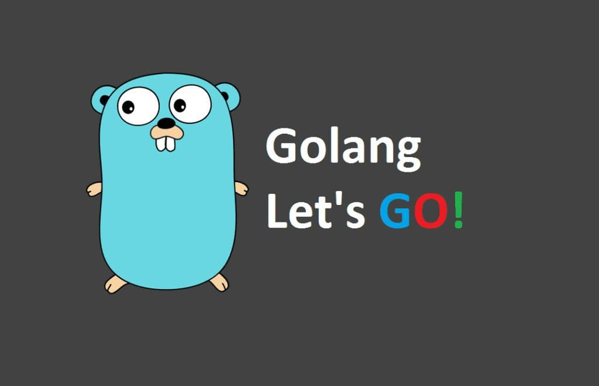

# A Crash Course on _golang_

  

I've create this repo to recollect myself for `golang` and have a quick recape to come back on the track. This repository store the implementation of some most common and necessary things in _golang_.  
This repository consists of the whole _golang_ environment along with the working directory 
containerized using **Docker**. All what you need is to have the docker installed on your machine.  

## Quick Set-Up  
Just follow the following easy steps to run the codes present in the repository without worrying about installing the _go_ on your system locally!  

### (A) Without 'docker-compose.yml'  
__While using very first time:__  

> 1. Navigate to the *Golang-Programs* directory.   
> 2. Run the following command -  
> ```  
> docker build . -t golang-tuts:1.0  
> ```  
> This command builds an image using the Dockerfile i.e. already present in this directory.  
> Here **-t** tags the image i.e. gives an *alternative name to the image* that is being build. It helps it identify the image easily rather than using its id.  

__Use the following command to run the assecc _golang_ utilities on command line:__  
> **Once the image is created, we are good to go ahead to run it, whenever needed.**  
> ```
> docker run -it --rm golang-tuts:1.0
> ```  
> Here:  
> **-it** stands for *interactive terminal*  
> **--rm** Automatically remove the container when it exits i.e. stops  

_As: Use comend line to run desired commands._  
_Put all the _golang_ files (**.go**) file in **src** directory._  

---  

### (B) Using 'docker-compose.yml'  
__While using very first time:__   
> 1. Navigate to the *Golang-Programs* directory.  
> 2. Run the following command -  
> ```  
> docker-compose up  
> ```  
> This command builds an image using the Dockerfile i.e. already present in this directory.   
> Here **--no-rm** used not to remove the intermediate containers that are also build during creating this image named *golang-programs_golang*   
>    

__Use the following command to run the _golang_ on command line:__ <br />
> **Once the image is created, we are good to go ahead to run it, whenever needed.** <br />
> ```
> docker run -it --rm golang-programs_golang
> ```
> Here  
> **-it** stands for *interactive terminal* <br />
> **--rm** Automatically remove the container when it exits i.e. stops <br />
>

### (C) Using shell scripts  

You can also execute everything just using a single shell command.  
We have provided you 2 shell scripts:  

1. **`build.sh`** :  
> - it builds the image i.e. followed by running the container to provide you the access to _go_ runtime via `bash`  
> - run ```sh ./build.sh```  

2. **`run.sh`** :  
> - it just pulls an existing image (if any) and runs it to provide you the access to _go_ runtime via `bash`  
> - run ```sh ./run.sh```  

## Todo  

There is a long way to go... I aim to add following additional things into this repo:  
1. A go command/syntex cheatsheet  
2. Detailed description (with examples) on _goroutine_ and _http server_  ...

Conttributions are happily accepted!!  

---  

[_visit here_](Golang-Programs) _for a quick walkthrough with ```golang```_

